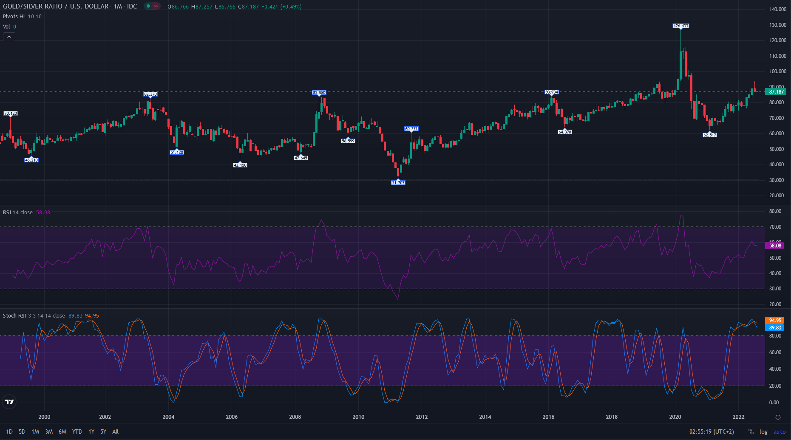

# [🌕 Gold/Silver Ratio Metal Chart 🌑](https://ayidouble.github.io/Gold-Silver-Ratio-Metal-Chart)
🌕 Gold/Silver ratio metal charts with the USD/CHF price movements of Gold/Silver 🌑

**Link** : **[https://ayidouble.github.io/Gold-Silver-Ratio-Metal-Chart](https://ayidouble.github.io/Gold-Silver-Ratio-Metal-Chart)** 

# [🌕 Gold/Silver Ratio Metal Chart 🌑](https://ayidouble.github.io/Gold-Silver-Ratio-Metal-Chart)

## [🌕 USD/Gold Per Ounce Chart 💹](https://ayidouble.github.io/Gold-Silver-Ratio-Metal-Chart/USDGOLDOUNCE)

## [🌑 USD/Silver Per Ounce Chart 💹](https://ayidouble.github.io/Gold-Silver-Ratio-Metal-Chart/USDSILVEROUNCE)

## [🌕 Gold/Silver Ratio Metal Chart 🌑](https://ayidouble.github.io/Gold-Silver-Ratio-Metal-Chart/GOLDSILVERRATIO)

## [🌑 CHF/Silver Per Kg (Kilogram) Chart 💹](https://ayidouble.github.io/Gold-Silver-Ratio-Metal-Chart/CHFSILVERKG)

## [🌕 CHF/Gold Per Kg (Kilogram) Chart 💹](https://ayidouble.github.io/Gold-Silver-Ratio-Metal-Chart/CHFGOLDKG)

